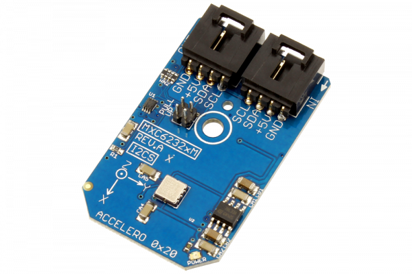

[](https://store.ncd.io/product/mxc6232xm-low-power-%C2%B12g-dual-axis-accelerometer-i2c-mini-module/).

#  MXC6232xM

The MEMSIC Digital Thermal Orientation Sensor (DTOS) is the world’s first fully-integrated orientation sensor.Its operation is based on our patented MEMS-thermal technology and is built using a standard 0.18um CMOS process. DTOS contains no moving parts and thus eliminates field-reliability and repeatability issues associated with competitive products. It also eliminates the “click” sounds typically heard in ball-based orientation sensors.
This Device is available from www.ncd.io 

[SKU: MXC6232xM]

(https://store.ncd.io/product/mxc6232xm-low-power-%C2%B12g-dual-axis-accelerometer-i2c-mini-module/)
This Sample code can be used with Raspberry Pi.

Hardware needed to interface MXC6232xM 2Axis accelometer sensor With Raspberry Pi :
1. <a href="https://store.ncd.io/product/mxc6232xm-low-power-%C2%B12g-dual-axis-accelerometer-i2c-mini-module/">MXC6232xM 2Axis accelometer sensor</a>
2.  <a href="https://store.ncd.io/product/i2c-shield-for-raspberry-pi-3-pi2-with-outward-facing-i2c-port-terminates-over-hdmi-port/">Raspberry Pi I2C Shield</a>
3. <a href="https://store.ncd.io/product/i%C2%B2c-cable/">I2C Cable</a>

## Python
Download and install smbus library on Raspberry pi. Steps to install smbus are provided at:

https://pypi.python.org/pypi/smbus-cffi/0.5.1

Download (or git pull) the code in pi. Run the program.

```cpp
$> python MXC6232xM.py
```
The lib is a sample library, you will need to calibrate the sensor according to your application requirement.
